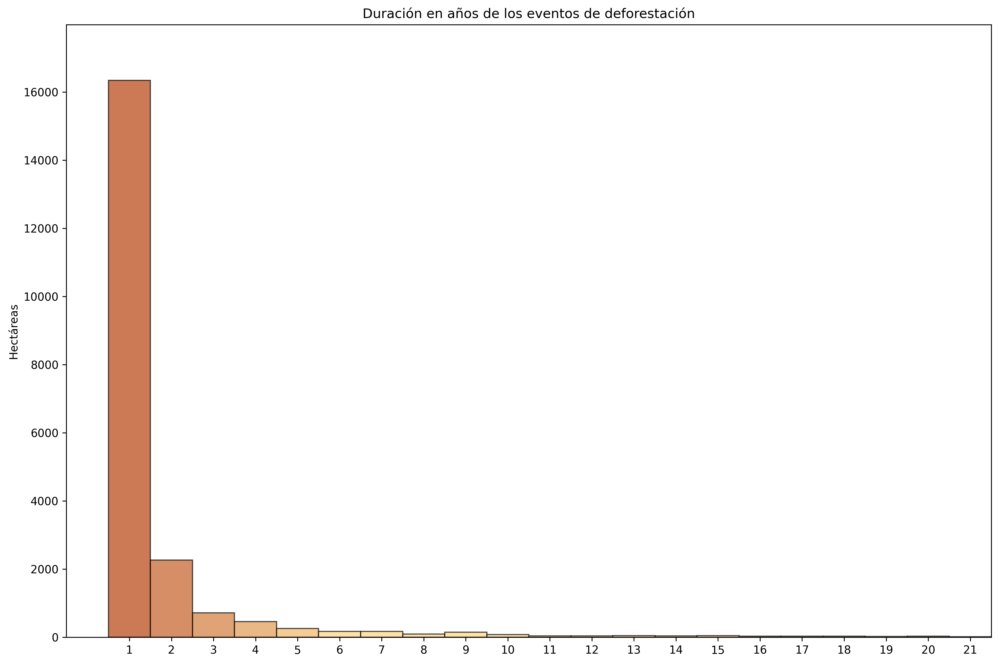

# Automated Monitoring of Deforestation in Ucayali (Peru) using LandTrendr  
**Patterns, uncertainty, and conservation applications (2001–2021)**

This project explores how **LandTrendr-derived Landsat time-series change metrics** can support **automated monitoring of deforestation** in the Peruvian Amazon, using a case study area in **Ucayali (Padre Abad province)**.

It focuses on:
- Translating LandTrendr segment metrics into decision-ready indicators
- Comparing “deforested” vs “non-deforested” pixels using a reference mask (Hansen Global Forest Change)
- Understanding uncertainty drivers (dispersion, overlap, outliers) that complicate classification

---

## Context (why this matters)

Deforestation is a major driver of biodiversity loss and greenhouse-gas emissions. 


Peru contains a significant share of the Amazon forest, and **Ucayali** is among the regions most affected by forest loss. In this case study, the analysis covers **2001–2021** and supports the broader goal of building monitoring pipelines for conservation, MRV, and early-warning systems.

---

## Study area

- Region: **Ucayali, Peru** (Padre Abad province)
- Period analysed: **2001–2021**
- Spatial framework: LandTrendr outputs aggregated per pixel for the strongest negative segment (“Loss Big-Delta”) within the analysis window.


---

## Data sources

### 1) Spectral change metrics (LandTrendr)
LandTrendr fits a piecewise linear model to Landsat time-series, capturing abrupt disturbances and gradual trends while reducing noise (e.g., cloud contamination, sensor artefacts).


For each pixel, the project uses the **largest negative segment** (“Loss Big-Delta”) between 2001 and 2021 and exports results as GeoTIFF (multi-band).

Key derived attributes (per pixel):
- **yod** — year of disturbance
- **magnitude** — change magnitude between segment vertices
- **duration** — segment duration (years)
- **preval** — pre-change spectral value
- **rate** — magnitude / duration
- **DSNR** — signal-to-noise ratio proxy

The segmentation index used is **TCW (Tasseled Cap Wetness)**, which is sensitive to vegetation cover change.

### 2) Reference mask (deforested vs non-deforested)
A boolean reference mask is derived from **Hansen Global Forest Change (GFC v1.11)** for the 2001–2021 period, used to compare distributions and validate separability.

---

## Methods (high level)

1. **Load LandTrendr raster outputs** (Loss Big-Delta) and the **reference mask**
2. **Build a per-pixel dataframe** from raster bands (predictors + label)
3. **EDA (univariate + bivariate)**:
   - distribution analysis (variance, outliers)
   - correlation checks / multicollinearity awareness
   - class comparisons (deforested vs non-deforested)
4. **Statistical testing**:
   - **Mann–Whitney U** tests for distribution differences across classes

---

## Key findings (summary)

### 1) Deforestation is concentrated in time and shows peak “loss years” (2001–2021)
**What we see:** The annual pattern of deforestation is not uniform; loss clusters in specific years, suggesting episodic disturbances (e.g., expansion fronts, infrastructure effects, commodity cycles, enforcement shifts).


— *Deforested area by year of disturbance (YOD)*

**Why it matters:** Peak years are actionable for monitoring (early warning), attribution work, and prioritising field verification.

---

### 2) Deforested pixels show stronger change signals (magnitude / rate / DSNR), but overlap remains
**What we see:** Compared with non-deforested pixels, deforested pixels tend to have higher **magnitude** and **rate** of change, and higher **DSNR** (signal-to-noise proxy). However, the class distributions overlap—so a simple threshold is unlikely to separate classes reliably.

 — *Class comparison (deforested vs non-deforested)*
 — *Magnitude vs DSNR (separability + overlap)*

**Why it matters:** These features are informative, but you’ll need robust modelling (or additional predictors) rather than single-rule classification.

---

### 3) Dispersion and outliers are a key challenge for classification and model stability
**What we see:** Feature distributions show wide dispersion and outliers in both classes. This can reflect mixed pixels (fragmentation), heterogeneous land cover, residual noise, or reference label uncertainty.

**Include these figures:**
 — *Distribution of key variables*
 — *Boxplots highlighting spread and outliers*
 — *Duration-related behaviour*

**Why it matters:** Outliers and heavy tails can dominate model learning and reduce generalisation—transformations and robust statistics become important.

---

### 4) Some predictors are correlated — multicollinearity needs to be managed
**What we see:** Several LandTrendr-derived metrics are correlated (e.g., magnitude, rate, prevalence-related measures). This affects interpretability and can inflate variance in some models.

**Include these figures:**
- `outputs/figures/matriz_correlacion.png` — *Correlation matrix*
- (Optional) `outputs/figures/scatterplot_mag_preval.png` — *Example bivariate relationship*

**Why it matters:** Feature selection, regularisation, or dimensionality reduction can improve stability and interpretability.

---

### 5) Practical implication: improvements should focus on transformations + feature engineering + additional context
**What we see:** Given overlap and dispersion, improvements are less about “more modelling” and more about making the signal cleaner and more separable:
- transformations (e.g., log transforms where appropriate)
- robust outlier handling
- combining multiple indices / contextual layers
- validating the reference mask quality and boundary effects

**Include these figures (as “evidence of need”):**
- `outputs/figures/variables_distribucion.png` — *shows dispersion/overlap*
- `outputs/figures/areas_deforestadas_vs_no_deforestadas.png` — *shows incomplete separability*

**Why it matters:** This frames your work as monitoring-driven and iteration-ready (a strong consulting / PM narrative).

---

## Recommended improvements (next iteration)

Based on the observed overlap/dispersion:
- Consider **log transforms** or other monotonic transforms to improve class separation
- Evaluate **outlier handling** (thresholding / robust estimators) and its impact on performance
- Explore **multi-class severity bins** (e.g., magnitude-based loss intensity) instead of a strict binary split
- Add complementary datasets (field data, additional EO layers) to reduce ambiguity and improve generalisation

---

## Start here (curated notebooks)

- `memoria.ipynb` — descriptive report (context, data, methods, findings)
- `notebooks/main_ROI1.ipynb` — main pipeline for ROI1 (minimal data required)
- `notebooks/main_ROI2.ipynb` — main pipeline for ROI2 (minimal data required)

---

## Data availability & reproducibility

This repo is intentionally kept lightweight. Large datasets should not be committed to Git history.

If you plan to run `main_ROI1.ipynb` / `main_ROI2.ipynb`, place the minimal required GeoTIFFs in:

- `src/data/`

The `.gitignore` is configured to:
- ignore all data by default
- allow only the minimal ROI files required by the two main notebooks (ROI1/ROI2)

---

## Repository structure

```text
deforestation-monitoring-insights/
├── README.md
├── .gitignore
├── memoria.ipynb                 # report notebook
├── notebooks/                    # curated notebooks
│   ├── main_ROI1.ipynb
│   └── main_ROI2.ipynb
├── outputs/
│   └── figures/                  # charts used in the report
├── assets/                       # optional additional assets
├── docs/                         # optional exported report/slides
└── src/
    ├── data/                     # local data (mostly ignored by git)
    └── utils/                    # helper functions (funciones.py, etc.)


