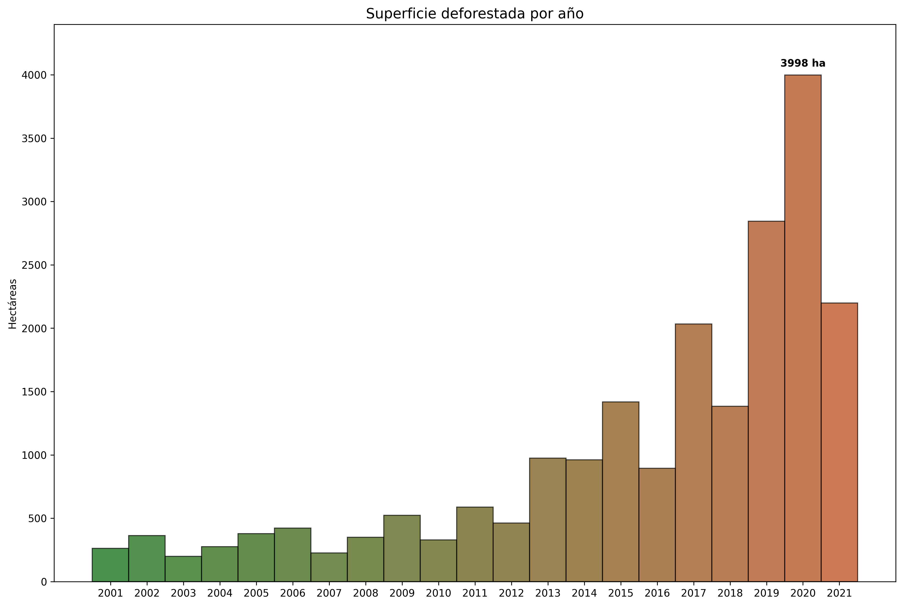
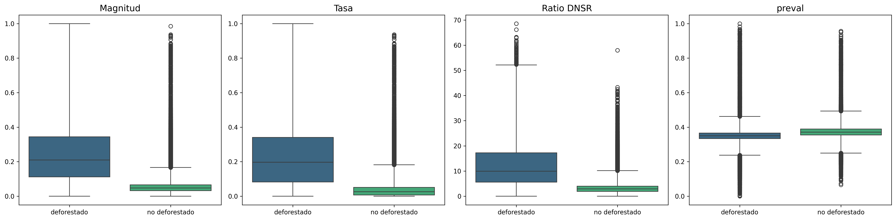
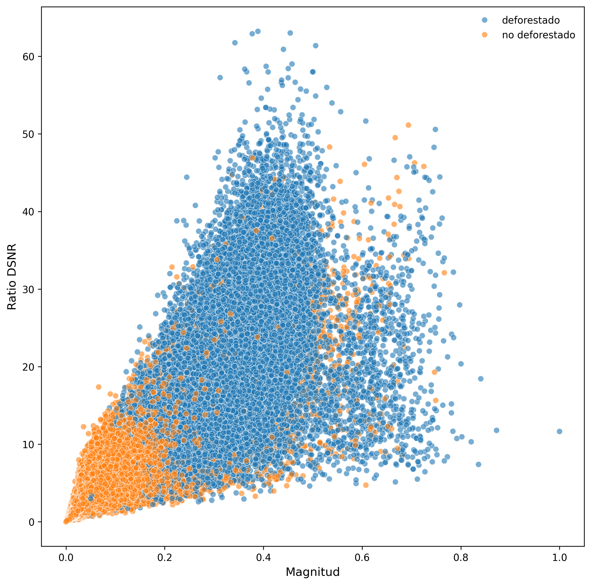
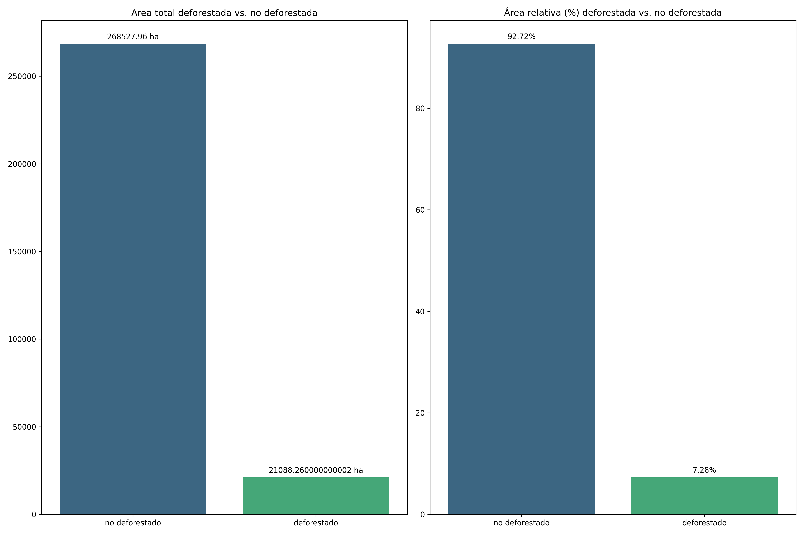
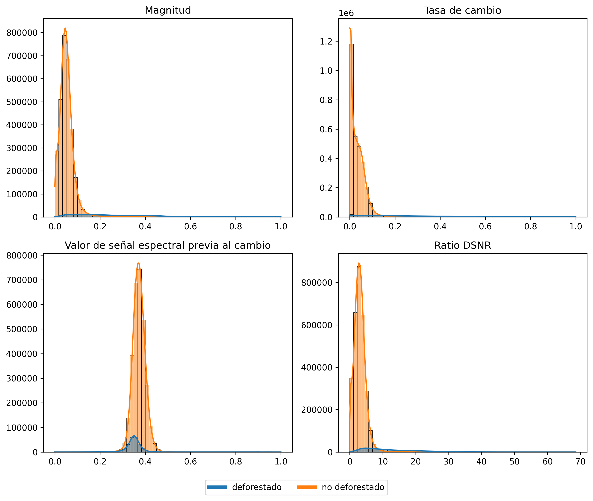
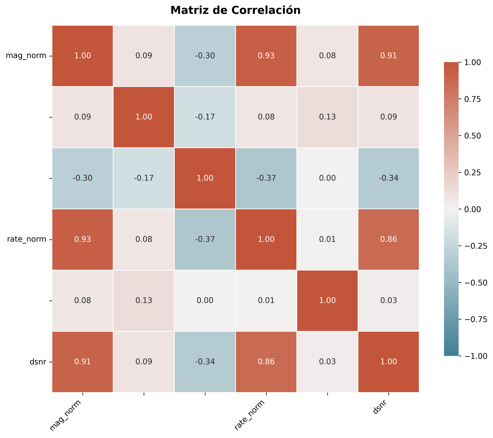

# Automated Deforestation Monitoring in the Peruvian Amazon using LandTrendr-Derived Spectral Change Metrics (2001–2021)
**Patterns, uncertainty, and conservation applications (2001–2021)**

This project explores how **LandTrendr-derived Landsat time-series change metrics** can support **automated monitoring of deforestation** in the Peruvian Amazon, using a case study area in **Ucayali (Padre Abad province)**.

It focuses on:
- Translating LandTrendr segment metrics into decision-ready indicators
- Comparing “deforested” vs “non-deforested” pixels using a reference mask (Hansen Global Forest Change)
- Understanding uncertainty drivers (dispersion, overlap, outliers) that complicate classification

---

## Context (why this matters)

Deforestation is a major driver of biodiversity loss and greenhouse-gas emissions. This type of automated disturbance detection supports MRV (Measurement, Reporting and Verification) systems and scalable forest governance monitoring.


Peru contains a significant share of the Amazon forest, and **Ucayali** is among the regions most affected by forest loss. In this case study, the analysis covers **2001–2021** and supports the broader goal of building monitoring pipelines for conservation, MRV, and early-warning systems.

---

## Study area

- Region: **Ucayali, Peru** (Padre Abad province)
- Period analysed: **2001–2021**
- Spatial framework: LandTrendr outputs aggregated per pixel for the strongest negative segment (“Loss Big-Delta”) within the analysis window.


---

## Data sources

### 1) Spectral change metrics (LandTrendr)
LandTrendr fits a piecewise linear model to Landsat time-series, capturing abrupt disturbances and gradual trends while reducing noise (e.g., cloud contamination, sensor artefacts).


For each pixel, the project uses the **largest negative segment** (“Loss Big-Delta”) between 2001 and 2021 and exports results as GeoTIFF (multi-band). Focusing on the strongest negative segment prioritises major disturbance events while potentially underrepresenting subtle degradation processes.

Key derived attributes (per pixel):
- **yod** — year of disturbance
- **magnitude** — change magnitude between segment vertices
- **duration** — segment duration (years)
- **preval** — pre-change spectral value
- **rate** — magnitude / duration
- **DSNR** — signal-to-noise ratio proxy

The segmentation index used is **TCW (Tasseled Cap Wetness)**, which is sensitive to vegetation cover change.

### 2) Reference mask (deforested vs non-deforested)
A boolean reference mask is derived from **Hansen Global Forest Change (GFC v1.11)** for the 2001–2021 period, used to compare distributions and validate separability.

---

## Methods (high level)

1. **Load LandTrendr raster outputs** (Loss Big-Delta) and the **reference mask**
2. **Build a per-pixel dataframe** from raster bands (predictors + label)
3. **EDA (univariate + bivariate + multivariate)**:
   - distribution analysis (variance, outliers)
   - correlation checks / multicollinearity awareness
   - class comparisons (deforested vs non-deforested)
4. **Statistical testing**:
   - **Mann–Whitney U** tests for distribution differences across classes

All analyses were conducted in Python using raster-based processing and pandas-based feature engineering.
No spatial autocorrelation correction was applied at this exploratory stage.

---

## Key findings (summary)

### 1) Deforestation is concentrated in time and shows peak “loss years” (2001–2021)
**What we see:** The annual pattern of deforestation is not uniform; loss clusters in specific years, suggesting episodic disturbance dynamics rather than steady background change. Certain years show clear peaks in affected area, indicating temporally concentrated expansion fronts or disturbance pulses.

— *Deforested area by year of disturbance (YOD)*


**Why it matters:** Temporal clustering suggests that deforestation is driven by structural drivers (e.g., expansion cycles, infrastructure influence, commodity dynamics, enforcement variation) rather than random noise. For monitoring systems, this implies that models should be evaluated across disturbance peaks and not only under average conditions. Incorporating year-of-disturbance (YOD) dynamics can improve early-warning prioritisation, hotspot detection and attribution analysis.

---

### 2) Deforested pixels show stronger change signals (magnitude / rate / DSNR), but overlap remains
**What we see:** Compared with non-deforested pixels, deforested pixels tend to exhibit higher **magnitude** and **rate of change**, as well as higher **DSNR** values (signal-to-noise proxy). The boxplots show clear upward shifts in central tendency and dispersion for these variables in the deforested class, indicating stronger and more abrupt spectral responses. 

— *Magnitude, rate, DSNR & preval distribution in deforested and non-deforeted classes*


However, the **class distributions overlap substantially**, and the scatterplot (Magnitude vs. DSNR) reveals a wide shared region where both classes coexist. Separability is evident in extreme values, but ambiguous in low-to-moderate ranges.

— *Magnitude vs DSNR (separability + overlap)*


Additionally, **the dataset is strongly imbalanced** (~93% non-deforested vs. ~7% deforested) which poses an additional challenge for classification. 

— *Class comparison (deforested vs non-deforested)*



**Why it matters:** Magnitude, rate and DSNR contain clear discriminatory signal, but overlap in the central feature space and strong class imbalance constrain separability. High overall accuracy may mask poor detection of deforestation if class-sensitive metrics are not used. Robust modelling approaches—incorporating class weighting, resampling strategies, and evaluation based on precision/recall rather than accuracy alone—are necessary to capture minority-class dynamics reliably.

---

### 3) Dispersion and outliers are a key challenge for classification and model stability
**What we see:** Feature distributions exhibit strong dispersion and right-skewness in both classes, with heavy tails particularly evident for magnitude, rate and DSNR. While extreme values are more frequent in the deforested class, substantial variability is also present in non-deforested pixels.

— *Distribution of key variables*


This pattern likely reflects mixed pixels in fragmented landscapes, heterogeneous baseline conditions, residual time-series noise and potential reference label uncertainty.

**Why it matters:** Heavy-tailed distributions can destabilise parametric models and inflate the influence of rare extreme observations. Without distribution-aware preprocessing, models may overfit to outliers rather than learn generalisable disturbance patterns. In monitoring contexts, unaddressed dispersion may also reduce transferability across regions or time periods. Log transformations, robust scaling and controlled tail handling therefore become important steps in pipeline design.

---

### 4) Some predictors are correlated — multicollinearity needs to be managed
**What we see:** The correlation matrix shows strong linear relationships among several LandTrendr-derived metrics, particularly magnitude, rate and DSNR (r ≈ 0.86–0.93). These variables capture closely related aspects of disturbance intensity rather than independent dimensions of change.

 — *Correlation matrix*
 

**Why it matters:** High multicollinearity can inflate coefficient variance in regression-based models and reduce interpretability. While tree-based models are more robust, redundancy may still dilute feature importance attribution and increase computational complexity. Feature selection, regularisation or dimensionality reduction can improve model stability and clarify the disturbance signal axis captured by these predictors.

---

### 5) Separability increases with disturbance intensity
**What we see:** Extreme magnitude and DSNR values are predominantly associated with deforested pixels, whereas overlap is concentrated in low-to-moderate ranges. Severe disturbance events are more clearly separable than subtle canopy degradation or partial loss.

— *shows incomplete separability*
 

**Why it matters:** Binary classification may obscure meaningful variation in disturbance intensity. Introducing severity bins (e.g., low / medium / high disturbance) or hierarchical modelling approaches could reduce ambiguity in marginal cases and improve ecological interpretability. This supports moving beyond strict binary splits toward disturbance-intensity-aware monitoring.

---

### 6) Practical implication: improvements should focus on signal refinement rather than model complexity
**What we see:** Given the observed overlap, dispersion and redundancy among predictors, the limitation is not absence of signal but structural ambiguity in the feature space.

**Why it matters:** Performance improvements are more likely to arise from improving signal structure rather than increasing algorithmic complexity. Emphasis should be placed on:

- Distribution-aware transformations (e.g., log scaling where appropriate)
- Robust outlier handling
- Feature engineering that captures disturbance dynamics more explicitly
- Incorporation of spatial or contextual predictors
- Validation of reference mask quality and boundary effects

This reframes the task from “trying more models” to **building a cleaner and more separable disturbance signal**, which is critical for scalable, transferable monitoring systems in tropical forest contexts.

---

## Recommended improvements (next iteration)

Based on the observed overlap/dispersion:
- Consider **log transforms** or other monotonic transforms to improve class separation
- Evaluate **outlier handling** (thresholding / robust estimators) and its impact on performance
- Explore **multi-class severity bins** (e.g., magnitude-based loss intensity) instead of a strict binary split
- Add complementary datasets (field data, additional EO layers) to reduce ambiguity and improve generalisation

These improvements aim to enhance signal geometry before scaling toward operational classification.

---

## Start here (curated notebooks)

- `memoria.ipynb` — descriptive report (context, data, methods, findings)
- `notebooks/main_ROI1.ipynb` — main pipeline for ROI1 (minimal data required)
- `notebooks/main_ROI2.ipynb` — main pipeline for ROI2 (minimal data required)

---

## Data availability & reproducibility

This repo is intentionally kept lightweight. Large datasets should not be committed to Git history.

If you plan to run `main_ROI1.ipynb` / `main_ROI2.ipynb`, place the minimal required GeoTIFFs in:

- `src/data/`

The `.gitignore` is configured to:
- ignore all data by default
- allow only the minimal ROI files required by the two main notebooks (ROI1/ROI2)

---

## Repository structure

```text
deforestation-monitoring-insights/
├── README.md
├── .gitignore
├── memoria.ipynb                 # report notebook
├── notebooks/                    # curated notebooks
│   ├── main_ROI1.ipynb
│   └── main_ROI2.ipynb
├── outputs/
│   └── figures/                  # charts used in the report
├── assets/                       # optional additional assets
├── docs/                         # optional exported report/slides
└── src/
    ├── data/                     # local data (mostly ignored by git)
    └── utils/                    # helper functions (funciones.py, etc.)

The project is intentionally structured to separate exploratory analysis (notebooks) from reusable utilities (src/utils), facilitating scalability.


